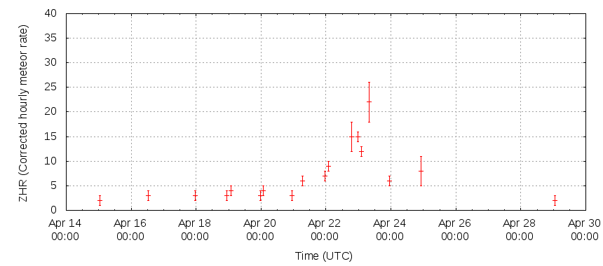

# python-qgis
This is a code experiment on using Python and QGIS for geospatial visualizations on the Visual Meteor Database (VMDB).

The VMDB contains about 3x10^6 meteors obtained by standarized observing methods collected during
the last 25 years. The actual DB is stored in dBase or ASCII format.

http://www.imo.net/data/visual



## 1) Installation (Linux)

```bash
$ sudo apt-get install gqis
```

## 2) Downloading the data

```bash
$ wget http://www.imo.net/files/data/vmdb/MAGN_11.TXT
$ wget http://www.imo.net/files/data/vmdb/vmdbsite.txt
```

## 3) Python dependencies

```bash
$ sudo pip install nominatim geopy python-geoip python-geoip-geolite2 ping
```

## Reversing address based on lat + lon coordinates

```python
geolocator = Nominatim()
location = geolocator.reverse("52.509669, 13.376294")
```

## Geoip

```python
from geoip import geolite2
locate = geolite2.lookup('127.0.0.1')
if locate is not None:
  print match.country
```

## Network ping

```python
import ping
verbose_ping("google.com")
```

## Reference

Nominatim Search service Developers Guide
http://open.mapquestapi.com/nominatim/
